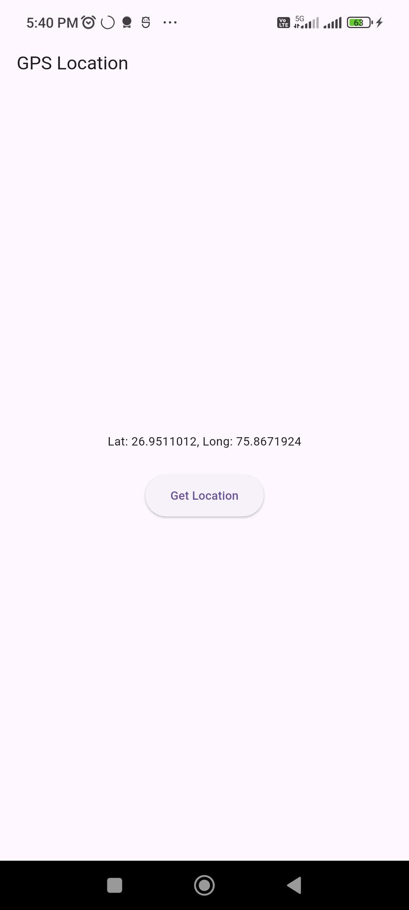

# Experiment 7: GPS Location Application

## Student Information
* **Name:** Ayush  
* **Roll Number:** 23EACAD025  
* **Batch:** Alpha-1  
* **Section:** G-1  
* **Department:** Artificial Intelligence & Data Science  
* **Course:** B.Tech – AI & Data Science  

---

## Aim
To develop a Flutter application that uses the **geolocator package** to fetch and display GPS location information (latitude and longitude).

---

## Procedure
1. Added `geolocator` dependency in `pubspec.yaml`.  
2. Imported `geolocator` package in the Dart file.  
3. Created a `StatefulWidget` to manage dynamic location data.  
4. Implemented `getLocation()` function to:  
   - Check if location services are enabled.  
   - Request permissions if not already granted.  
   - Fetch current position using `Geolocator.getCurrentPosition()`.  
5. Displayed latitude and longitude on the screen.  
6. Used `setState()` to update UI when location data changes.  

---

## Output
The application successfully fetches and displays latitude and longitude coordinates on the screen when the **Get Location** button is pressed.



---

## Conclusion
This experiment demonstrated how to integrate **GPS functionality** in Flutter using the `geolocator` package, including permission handling and dynamic UI updates.

---

## How to Run
1. Create a new Flutter project:  
   ```bash
   flutter create experiment_7
   cd experiment_7
